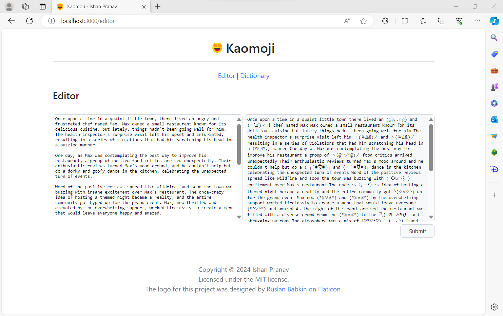

<!-- README.md -->
<!-- Copyright (c) 2024 Ishan Pranav -->
<!-- Licensed under the MIT License. -->

# Kaomoji

A web application that replaces text with kaomoji, implemented for the NYU CSCI
467 Applied Internet Technology course and distributed under the MIT License.

## Screenshots

## License

This repository is licensed with the [MIT](LICENSE.txt) license.

## Attribution

The logo for this project was designed by
[Ruslan Babkin on Flaticon](https://www.flaticon.com/free-icons/smile).
